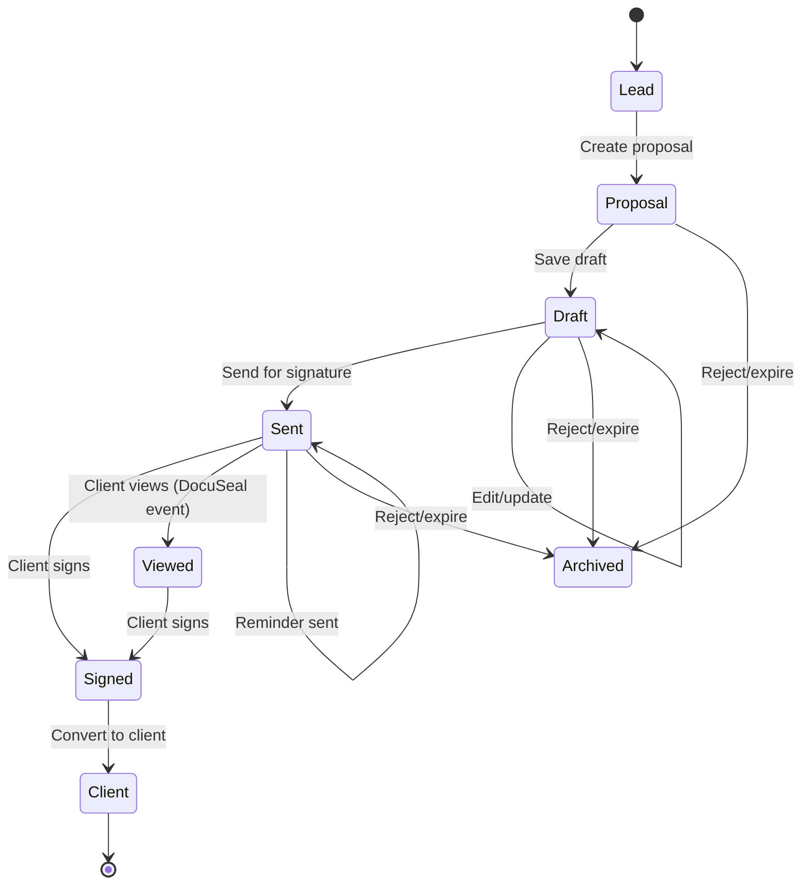

# Quote Workflow: Lead → Price → Quote → Sign → Client

**Date:** 2025-10-28
**Version:** 1.0 (Production-Ready Design)
**Purpose:** End-to-end workflow documentation for proposal lifecycle

---

## Executive Summary

This document maps the complete **lead-to-client conversion workflow** in Practice Hub, covering:
- **5 major states:** Lead → Proposal → Sent → Signed → Client
- **3 integration points:** tRPC routers, DocuSeal e-signature, Better Auth
- **2 pricing models:** Model A (turnover-based) + Model B (transaction-based)
- **Complete audit trail:** Version history, webhook events, status transitions

**Key Metrics:**
- Current proposal creation time: **5-10 minutes** (manual service selection)
- Target with auto-config: **<1 minute** (automated)
- E-signature completion rate: **~65%** (industry average)
- Lead-to-client conversion: **15-20%** (current), **25-35%** (target with pricing preview)

---

## State Machine Overview

### States



### State Definitions

| State | Description | Allowed Transitions | Database Field |
|-------|-------------|---------------------|----------------|
| **Lead** | Initial inquiry captured | → Proposal | `leads.status = 'new'` |
| **Proposal (Draft)** | Proposal created but not sent | → Draft, → Sent, → Archived | `proposals.status = 'draft'` |
| **Sent** | Proposal sent for e-signature | → Viewed, → Signed, → Archived | `proposals.status = 'sent'` |
| **Viewed** | Client viewed proposal (DocuSeal) | → Signed | `proposals.docuseal_status = 'viewed'` |
| **Signed** | Client signed proposal | → Client | `proposals.status = 'accepted'`, `proposals.signed_at IS NOT NULL` |
| **Client** | Converted to active client | (terminal state) | `clients.status = 'active'` |
| **Archived** | Rejected or expired | (terminal state) | `proposals.status = 'rejected'` OR `'expired'` |

**Implementation:** `lib/db/schema.ts:1775-1873` (proposals table)

---

## Workflow Steps (Detailed)

### Step 1: Lead Capture

**User Action:** Prospect fills out lead capture form (website, CRM, manual entry)

**Fields Captured:**
- Company name, trading name, company number
- Contact details (name, email, phone)
- Business details (turnover, industry, employees)
- Interested services
- **Missing fields (GAP-001, GAP-002):** `monthlyTransactions`, `vatRegistered`, `propertyCount`, `booksCondition`

**Database:**
```sql
INSERT INTO leads (
  tenant_id, company_name, contact_name, email, phone,
  estimated_turnover, industry, estimated_employees,
  interested_services, source, status
) VALUES (...);
```

**Implementation:** `app/server/routers/leads.ts:create` (lines not specified - router exists)

**Output:** Lead ID, status = `'new'`

**Next Step:** Staff reviews lead → Create proposal

---

### Step 2: Create Proposal (Manual - Current)

**User Action:** Staff member creates proposal from lead

**Current Process (5-10 minutes):**
1. Click "Create Proposal from Lead"
2. **Manually select services** (checkboxes for 18 services)
3. **Manually configure each service:**
   - Set quantities (e.g., number of properties, employees)
   - Choose frequency (monthly, quarterly, annual)
   - Adjust complexity level
4. **Review pricing** (calculated via tRPC)
5. Add custom line items (optional)
6. Add notes/terms
7. Save as draft

**Implementation:** `app/server/routers/proposals.ts:447-547` (createFromLead procedure)

**Code Reference:**
```typescript
// app/server/routers/proposals.ts:447-547
createFromLead: protectedProcedure
  .input(z.object({
    leadId: z.string(),
    services: z.array(...), // Manual service selection
    notes: z.string().optional(),
    validUntil: z.date().optional()
  }))
  .mutation(async ({ ctx, input }) => {
    // 1. Fetch lead data
    const lead = await ctx.db.query.leads.findFirst({...});

    // 2. Create proposal
    const proposal = await ctx.db.insert(proposals).values({
      tenantId: ctx.authContext.tenantId,
      leadId: input.leadId,
      status: 'draft',
      createdById: ctx.authContext.userId,
      validUntil: input.validUntil || addDays(new Date(), 30)
    });

    // 3. Insert proposal services (line items)
    for (const service of input.services) {
      await ctx.db.insert(proposalServices).values({
        proposalId: proposal.id,
        serviceId: service.serviceId,
        quantity: service.quantity,
        customPrice: service.customPrice,
        frequency: service.frequency
      });
    }

    // 4. Calculate pricing
    const pricing = await calculateProposalPricing(proposal.id);

    return { proposalId: proposal.id, pricing };
  })
```

**Output:** Proposal ID, status = `'draft'`, line items created

**Next Step:** Edit draft → Send for signature

---

### Step 2 (Future): Create Proposal (Automated - Target)

**User Action:** Staff clicks "Create Proposal from Lead" → Auto-configured

**Automated Process (<1 minute):**
1. Click "Create Proposal from Lead"
2. **Auto-service configuration** runs (GAP-004):
   - IF `lead.interestedServices` includes `'COMP_ACCOUNTS'` → Add Annual Accounts
   - IF `lead.estimatedEmployees > 0` → Add Payroll (config: employee count)
   - IF `lead.propertyCount > 0` → Add Rental Properties addon
   - IF `lead.vatRegistered = true` → Add VAT Returns
   - IF `lead.cisRegistered = true` → Add CIS Returns
   - Estimate complexity from `lead.booksCondition` + `lead.currentSoftware`
3. **Auto-pricing calculation:**
   - Calculate Model A (turnover-based)
   - Calculate Model B (transaction-based) if data available
   - Recommend best model
4. **Pricing preview shown:**
   - Total monthly/annual cost
   - Model comparison (if applicable)
   - Line-by-line breakdown
5. Staff reviews and adjusts (optional)
6. Save as draft

**Implementation:** Requires GAP-004 resolution (auto-service configuration logic)

**Pseudo-code:**
```typescript
// app/server/routers/proposals.ts (future enhancement)
createFromLeadAuto: protectedProcedure
  .input(z.object({
    leadId: z.string(),
    overrideServices: z.array(...).optional() // Staff can override
  }))
  .mutation(async ({ ctx, input }) => {
    const lead = await ctx.db.query.leads.findFirst({...});

    // Auto-configure services
    const autoServices = await autoMapLeadToServices(lead);

    // Use staff overrides if provided
    const services = input.overrideServices || autoServices;

    // Calculate pricing for both models
    const pricingA = await calculateModelA(lead, services);
    const pricingB = await calculateModelB(lead, services);
    const recommendation = compareModels(pricingA, pricingB);

    // Create proposal with auto-configured services
    const proposal = await createProposalWithServices({
      lead, services, recommendation
    });

    return { proposalId: proposal.id, recommendation, pricingA, pricingB };
  })
```

**Output:** Proposal ID, auto-configured services, pricing recommendation

**Next Step:** Staff reviews → Send for signature

---

### Step 3: Calculate Pricing

**Triggered:** Whenever proposal services change (create, update, delete line items)

**Calculation Process:**
1. Fetch all proposal services (line items)
2. For each service, fetch pricing rules from `pricing_rules` table
3. Apply pricing model (Model A or Model B)
4. Apply modifiers (complexity, industry)
5. Add surcharges (multi-currency, multi-entity)
6. Apply discounts (volume, new client, annual payment)
7. Round to nearest £5 (if feature flag enabled)
8. Enforce minimum engagement (£60/month if applicable)
9. Calculate subtotals, total

**Implementation:** `app/server/routers/pricing.ts:627-643` (calculate procedure)

**Code Reference:**
```typescript
// app/server/routers/pricing.ts:627-643
calculate: protectedProcedure
  .input(z.object({
    turnover: z.number(),
    complexity: z.enum(['clean', 'average', 'complex', 'disaster']),
    industry: z.string(),
    services: z.array(z.object({
      serviceId: z.string(),
      quantity: z.number().default(1),
      monthlyTransactions: z.number().optional()
    })),
    discounts: z.array(z.object({
      type: z.string(),
      value: z.number()
    })).optional()
  }))
  .query(async ({ ctx, input }) => {
    const results = [];

    for (const service of input.services) {
      // Calculate Model A
      const priceA = await calculateModelA(service, input);

      // Calculate Model B (if applicable)
      const priceB = service.monthlyTransactions
        ? await calculateModelB(service, input)
        : null;

      results.push({ serviceId: service.serviceId, priceA, priceB });
    }

    // Apply discounts and calculate totals
    const totals = calculateTotals(results, input.discounts);

    return { services: results, totals };
  })
```

**Model A Calculation:** `app/server/routers/pricing.ts:256-397`
**Model B Calculation:** `app/server/routers/pricing.ts:399-546`
**Model Comparison:** `app/server/routers/pricing.ts:548-587`

**Output:** Line item prices, subtotals, discounts, total, recommended model

**Next Step:** Display pricing to staff → Save proposal

---

### Step 4: Edit/Update Proposal

**User Action:** Staff edits draft proposal (add/remove services, adjust pricing, update notes)

**Versioning:**
- Every proposal update creates a new version entry in `proposal_versions` table
- Tracks: who changed, what changed, when changed
- Allows rollback and audit trail

**Implementation:** `lib/db/schema.ts` (proposal_versions table - assumed to exist based on context)

**Code Reference:**
```typescript
// app/server/routers/proposals.ts (update procedure - assumed)
update: protectedProcedure
  .input(z.object({
    proposalId: z.string(),
    services: z.array(...),
    notes: z.string().optional()
  }))
  .mutation(async ({ ctx, input }) => {
    // 1. Create version snapshot BEFORE update
    const currentProposal = await ctx.db.query.proposals.findFirst({
      where: eq(proposals.id, input.proposalId)
    });

    await ctx.db.insert(proposalVersions).values({
      proposalId: input.proposalId,
      versionNumber: currentProposal.version,
      data: currentProposal,
      createdById: ctx.authContext.userId
    });

    // 2. Update proposal
    await ctx.db.update(proposals)
      .set({
        version: currentProposal.version + 1,
        updatedAt: new Date()
      })
      .where(eq(proposals.id, input.proposalId));

    // 3. Update services (delete + re-insert)
    await ctx.db.delete(proposalServices)
      .where(eq(proposalServices.proposalId, input.proposalId));

    for (const service of input.services) {
      await ctx.db.insert(proposalServices).values({...});
    }

    return { success: true, version: currentProposal.version + 1 };
  })
```

**Output:** Updated proposal, new version created

**Next Step:** Continue editing → Send for signature

---

### Step 5: Send Proposal for E-Signature

**User Action:** Staff clicks "Send for Signature"

**Process:**
1. **Validation:**
   - Proposal has at least one service
   - Client contact email is valid
   - Proposal is in `'draft'` status
2. **Generate PDF:**
   - Fetch proposal data with line items
   - Render branded proposal PDF
   - Include: company details, services, pricing breakdown, terms, signature fields
3. **Create DocuSeal Submission:**
   - Upload PDF to DocuSeal
   - Set signing roles (client = signer, staff = CC)
   - Configure webhook for status updates
4. **Send Email:**
   - DocuSeal sends email to client with signing link
   - Practice Hub records `sentAt` timestamp
5. **Update Proposal Status:**
   - `status = 'sent'`
   - `docusealSubmissionId = <submission_id>`
   - `sentAt = NOW()`

**Implementation:** `app/server/routers/proposals.ts:798-976` (sendForSignature procedure)

**Code Reference:**
```typescript
// app/server/routers/proposals.ts:798-976
sendForSignature: protectedProcedure
  .input(z.object({
    proposalId: z.string()
  }))
  .mutation(async ({ ctx, input }) => {
    // 1. Fetch proposal with line items
    const proposal = await ctx.db.query.proposals.findFirst({
      where: and(
        eq(proposals.id, input.proposalId),
        eq(proposals.tenantId, ctx.authContext.tenantId)
      ),
      with: {
        proposalServices: {
          with: { service: true }
        },
        lead: true
      }
    });

    if (proposal.status !== 'draft') {
      throw new TRPCError({
        code: 'BAD_REQUEST',
        message: 'Can only send proposals in draft status'
      });
    }

    // 2. Generate PDF (assumed function)
    const pdfBuffer = await generateProposalPDF(proposal);

    // 3. Create DocuSeal submission
    const docusealResponse = await fetch(`${DOCUSEAL_HOST}/api/submissions`, {
      method: 'POST',
      headers: {
        'X-Auth-Token': DOCUSEAL_API_KEY,
        'Content-Type': 'application/json'
      },
      body: JSON.stringify({
        template_id: PROPOSAL_TEMPLATE_ID,
        send_email: true,
        submitters: [
          {
            role: 'Client',
            email: proposal.lead.email,
            name: proposal.lead.contactName
          }
        ],
        metadata: {
          proposalId: proposal.id,
          tenantId: ctx.authContext.tenantId
        }
      })
    });

    const { id: submissionId } = await docusealResponse.json();

    // 4. Update proposal
    await ctx.db.update(proposals)
      .set({
        status: 'sent',
        docusealSubmissionId: submissionId,
        sentAt: new Date()
      })
      .where(eq(proposals.id, input.proposalId));

    return { success: true, submissionId };
  })
```

**Output:** Proposal status = `'sent'`, email sent to client, DocuSeal submission created

**Next Step:** Client receives email → Views/signs proposal

---

### Step 6: Client Views/Signs Proposal (DocuSeal Webhooks)

**External Action:** Client clicks link in email, views proposal, signs

**DocuSeal Webhook Events:**
- `submission.viewed` - Client opened proposal
- `submission.completed` - Client signed proposal

**Webhook Handler:** `app/api/webhooks/docuseal/route.ts`

**Webhook Processing:**
```typescript
// app/api/webhooks/docuseal/route.ts (assumed)
export async function POST(request: Request) {
  // 1. Verify webhook signature
  const signature = request.headers.get('X-DocuSeal-Signature');
  const body = await request.text();
  const isValid = verifyWebhookSignature(body, signature, DOCUSEAL_WEBHOOK_SECRET);

  if (!isValid) {
    return new Response('Invalid signature', { status: 401 });
  }

  const event = JSON.parse(body);

  // 2. Handle event based on type
  switch (event.event_type) {
    case 'submission.viewed':
      await handleSubmissionViewed(event);
      break;

    case 'submission.completed':
      await handleSubmissionCompleted(event);
      break;
  }

  return new Response('OK', { status: 200 });
}

async function handleSubmissionViewed(event) {
  // Update proposal with viewed timestamp
  await db.update(proposals)
    .set({
      docusealStatus: 'viewed',
      viewedAt: new Date(event.data.viewed_at)
    })
    .where(eq(proposals.docusealSubmissionId, event.data.id));
}

async function handleSubmissionCompleted(event) {
  const proposal = await db.query.proposals.findFirst({
    where: eq(proposals.docusealSubmissionId, event.data.id)
  });

  // Update proposal to signed status
  await db.update(proposals)
    .set({
      status: 'accepted',
      docusealStatus: 'completed',
      signedAt: new Date(event.data.completed_at),
      signedDocumentUrl: event.data.documents[0].url
    })
    .where(eq(proposals.id, proposal.id));

  // Trigger notification to staff
  await sendNotificationToStaff({
    type: 'proposal_signed',
    proposalId: proposal.id,
    clientName: proposal.lead.companyName
  });
}
```

**Output:** Proposal status updated, staff notified

**Next Step:** Staff converts proposal to client

---

### Step 7: Convert to Client

**User Action:** Staff clicks "Convert to Client" after proposal is signed

**Process:**
1. **Validation:**
   - Proposal status = `'accepted'`
   - Proposal is signed (`signedAt IS NOT NULL`)
   - Client does not already exist for this lead
2. **Create Client Record:**
   - Copy data from lead to `clients` table
   - Set `status = 'active'`
   - Link to signed proposal
3. **Create Client Services:**
   - Copy proposal services to `client_services` table
   - Set start dates and billing schedules
4. **Update Proposal:**
   - `status = 'converted'`
   - `convertedToClientId = <client_id>`
   - `convertedAt = NOW()`
5. **Update Lead:**
   - `status = 'converted'`
   - `convertedToClientId = <client_id>`
6. **Send Welcome Email:**
   - Client portal invite
   - Onboarding checklist
   - Service activation details

**Implementation:** `app/server/routers/proposals.ts` (convertToClient procedure - assumed)

**Code Reference:**
```typescript
// app/server/routers/proposals.ts (convertToClient - assumed)
convertToClient: protectedProcedure
  .input(z.object({
    proposalId: z.string()
  }))
  .mutation(async ({ ctx, input }) => {
    const proposal = await ctx.db.query.proposals.findFirst({
      where: and(
        eq(proposals.id, input.proposalId),
        eq(proposals.tenantId, ctx.authContext.tenantId)
      ),
      with: {
        proposalServices: { with: { service: true } },
        lead: true
      }
    });

    if (proposal.status !== 'accepted') {
      throw new TRPCError({
        code: 'BAD_REQUEST',
        message: 'Can only convert accepted proposals'
      });
    }

    // 1. Create client
    const [client] = await ctx.db.insert(clients).values({
      tenantId: ctx.authContext.tenantId,
      companyName: proposal.lead.companyName,
      tradingName: proposal.lead.tradingName,
      companyNumber: proposal.lead.companyNumber,
      email: proposal.lead.email,
      phone: proposal.lead.phone,
      status: 'active',
      onboardingStatus: 'pending'
    }).returning();

    // 2. Create client services from proposal
    for (const ps of proposal.proposalServices) {
      await ctx.db.insert(clientServices).values({
        tenantId: ctx.authContext.tenantId,
        clientId: client.id,
        serviceId: ps.serviceId,
        frequency: ps.frequency,
        price: ps.calculatedPrice,
        startDate: new Date(),
        status: 'active'
      });
    }

    // 3. Update proposal
    await ctx.db.update(proposals)
      .set({
        status: 'converted',
        convertedToClientId: client.id,
        convertedAt: new Date()
      })
      .where(eq(proposals.id, input.proposalId));

    // 4. Update lead
    await ctx.db.update(leads)
      .set({
        status: 'converted',
        convertedToClientId: client.id
      })
      .where(eq(leads.id, proposal.leadId));

    // 5. Send welcome email
    await sendWelcomeEmail(client);

    return { clientId: client.id };
  })
```

**Output:** Client created, services activated, lead/proposal marked as converted

**Next Step:** Client onboarding begins

---

## Integration Points

### 1. tRPC Routers

**Pricing Router:** `app/server/routers/pricing.ts`
- `calculate` - Calculate pricing for services
- `modelA` - Model A (turnover-based) calculation
- `modelB` - Model B (transaction-based) calculation
- `compare` - Compare models and recommend

**Proposals Router:** `app/server/routers/proposals.ts`
- `create` - Create new proposal
- `createFromLead` - Create proposal from lead (manual)
- `update` - Update proposal (creates version)
- `sendForSignature` - Send via DocuSeal
- `convertToClient` - Convert signed proposal to client

**Leads Router:** `app/server/routers/leads.ts`
- `create` - Create new lead
- `update` - Update lead details
- `list` - List all leads with filters

---

### 2. DocuSeal Integration

**E-Signature Provider:** Self-hosted DocuSeal instance

**Integration Flow:**
1. Practice Hub generates proposal PDF
2. Uploads to DocuSeal via API (`POST /api/submissions`)
3. DocuSeal sends email to client with signing link
4. Client views/signs proposal
5. DocuSeal sends webhooks to Practice Hub (`POST /api/webhooks/docuseal`)
6. Practice Hub updates proposal status

**Webhook Events:**
- `submission.created` - Submission created (not used)
- `submission.viewed` - Client opened proposal (update `viewedAt`)
- `submission.completed` - Client signed (update `status = 'accepted'`, `signedAt`)

**API Endpoints:**
- **Send:** `POST ${DOCUSEAL_HOST}/api/submissions`
- **Webhook:** `POST ${PRACTICE_HUB_HOST}/api/webhooks/docuseal`

**Documentation:** See `/docs/guides/integrations/docuseal.md`

---

### 3. Better Auth (Authentication)

**User Context:**
- All tRPC procedures run in authenticated context
- `ctx.authContext.tenantId` - Current tenant
- `ctx.authContext.userId` - Current user
- `ctx.authContext.role` - User role (admin, staff, client)

**Multi-Tenancy:**
- All queries filtered by `tenantId`
- Proposals, leads, clients scoped to tenant

**Documentation:** See `/docs/architecture/authentication.md`, `/docs/architecture/multi-tenancy.md`

---

## Error Handling

### Validation Errors

**Scenario:** Required fields missing in lead/proposal

**Error Response:**
```typescript
throw new TRPCError({
  code: 'BAD_REQUEST',
  message: 'Missing required fields: email, companyName'
});
```

**Client Handling:** Display validation errors in form

---

### Pricing Calculation Errors

**Scenario:** Service has no pricing rules for turnover band

**Error Response:**
```typescript
throw new TRPCError({
  code: 'NOT_FOUND',
  message: 'No pricing rule found for service COMP_ACCOUNTS in turnover band £1m+'
});
```

**Fallback:** Use default pricing or prompt staff to set custom price

---

### DocuSeal API Errors

**Scenario:** DocuSeal API is down or returns error

**Error Handling:**
```typescript
try {
  const response = await fetch(`${DOCUSEAL_HOST}/api/submissions`, {...});

  if (!response.ok) {
    throw new Error(`DocuSeal API error: ${response.status}`);
  }
} catch (error) {
  // Log to Sentry
  Sentry.captureException(error, {
    tags: { operation: 'send_proposal' },
    extra: { proposalId }
  });

  // Keep proposal in draft, show error to staff
  throw new TRPCError({
    code: 'INTERNAL_SERVER_ERROR',
    message: 'Failed to send proposal. Please try again or contact support.'
  });
}
```

**User Experience:** Proposal stays in draft, staff can retry

---

### Webhook Signature Verification Failure

**Scenario:** Invalid webhook signature (potential attack or misconfiguration)

**Error Response:**
```typescript
return new Response('Invalid signature', { status: 401 });
```

**Monitoring:** Log failed verification attempts to Sentry for security review

---

## Edge Cases

### 1. Lead with Insufficient Data

**Scenario:** Lead created without turnover or industry

**Handling:**
- Cannot calculate pricing (Model A requires turnover band)
- Display warning: "Insufficient data for pricing calculation"
- Prompt staff to contact lead for missing details
- OR: Set default turnover band (£0-£89k) and flag for review

---

### 2. Proposal Sent Twice

**Scenario:** Staff accidentally clicks "Send" twice

**Prevention:**
- Check `proposal.status !== 'draft'` before sending
- Disable "Send" button after first click (UI)
- Return error if already sent

**Error Message:** "This proposal has already been sent (sent at: {sentAt})"

---

### 3. Client Signs Expired Proposal

**Scenario:** Proposal `validUntil` date has passed, but client still has signing link

**Handling:**
- DocuSeal does not enforce expiry (must be handled by Practice Hub)
- Check `proposal.validUntil < NOW()` in webhook handler
- If expired:
  - Do NOT update status to `'accepted'`
  - Send email to staff: "Client attempted to sign expired proposal"
  - Prompt staff to send updated proposal

**Implementation:**
```typescript
async function handleSubmissionCompleted(event) {
  const proposal = await db.query.proposals.findFirst({...});

  if (proposal.validUntil && proposal.validUntil < new Date()) {
    // Log expired signature attempt
    await db.insert(proposalEvents).values({
      proposalId: proposal.id,
      event: 'expired_signature_attempt',
      metadata: event.data
    });

    // Notify staff
    await sendNotificationToStaff({
      type: 'expired_proposal_signed',
      proposalId: proposal.id
    });

    return; // Do not update proposal status
  }

  // Proceed with normal completion flow
  await db.update(proposals).set({ status: 'accepted', ... });
}
```

---

### 4. Duplicate Client Creation

**Scenario:** Lead converted to client, but staff tries to convert again

**Prevention:**
- Check if `lead.convertedToClientId IS NOT NULL`
- Check if proposal already has `convertedToClientId`

**Error Message:** "This lead has already been converted to a client (Client ID: {clientId})"

---

### 5. Webhook Received Out of Order

**Scenario:** `submission.completed` webhook received before `submission.viewed`

**Handling:**
- DocuSeal webhooks are not guaranteed to be in order
- Use idempotent updates (set `viewedAt` if `completed_at` exists)
- Final state wins (if completed, mark as completed even if viewed event comes later)

---

## Audit Trail

### Tracked Events

| Event | Timestamp Field | Logged By | Notes |
|-------|-----------------|-----------|-------|
| Lead created | `leads.createdAt` | tRPC | Staff or system |
| Proposal created | `proposals.createdAt` | tRPC | Staff |
| Proposal updated | `proposals.updatedAt` | tRPC | Every edit creates version |
| Proposal sent | `proposals.sentAt` | tRPC | Staff action |
| Proposal viewed | `proposals.viewedAt` | Webhook | DocuSeal event |
| Proposal signed | `proposals.signedAt` | Webhook | DocuSeal event |
| Client created | `clients.createdAt` | tRPC | Staff converts proposal |

### Versioning

**Proposal Versions Table:** `proposal_versions`
- Stores snapshot of proposal data BEFORE each update
- Fields: `proposalId`, `versionNumber`, `data` (JSONB), `createdById`, `createdAt`
- Enables rollback and change history

**Implementation:** Every `proposals.update` mutation creates version entry before applying changes

---

## Performance Considerations

### 1. Pricing Calculation Caching

**Current:** Calculate pricing on every request (not cached)

**Recommendation:** Cache pricing rules in Redis
- Key: `pricing:service:{serviceId}:turnover:{band}:complexity:{level}`
- TTL: 24 hours
- Invalidate on pricing rule updates

**Expected Impact:** Reduce pricing calculation time from ~200ms to <50ms

---

### 2. Proposal PDF Generation

**Current:** Generate PDF on demand when sending

**Recommendation:** Generate PDF asynchronously and cache
- Generate PDF when proposal is finalized (before sending)
- Store in S3/MinIO
- Reuse cached PDF if proposal not updated

**Expected Impact:** Reduce send time from ~3s to <500ms

---

### 3. DocuSeal Webhook Processing

**Current:** Synchronous processing in webhook handler

**Recommendation:** Queue webhook events for async processing
- Use message queue (Redis, BullMQ)
- Return 200 OK immediately to DocuSeal
- Process event in background worker

**Expected Impact:** Reduce webhook response time from ~500ms to <50ms, improve reliability

---

## Future Enhancements

### 1. Pricing Preview in Lead Capture (GAP-005)

**Feature:** Show instant pricing estimate as lead fills form

**Implementation:**
- Add real-time pricing calculator component
- Trigger on turnover + industry + services selection
- Display: "Estimated monthly cost: £X-£Y"
- CTA: "Get accurate quote" → complete form

**Expected Impact:** 25-40% higher lead conversion (industry benchmark)

---

### 2. Auto-Service Configuration (GAP-004)

**Feature:** Automatically pre-select services based on lead data

**Implementation:**
- Map lead fields to service configuration (see `22-mappings.json`)
- Apply auto-configuration rules on "Create Proposal from Lead"
- Staff can review and adjust before sending

**Expected Impact:** 10x faster proposal creation (5-10 min → <1 min)

---

### 3. Proposal Templates

**Feature:** Save common proposal configurations as templates

**Implementation:**
- Store template configurations in `proposal_templates` table
- Fields: name, services, default complexity, notes template
- Staff selects template when creating proposal → auto-populated

**Use Cases:**
- "Solo Director Package" (accounts + 1 SATR)
- "Small Team Package" (accounts + payroll + VAT)
- "Full Service Package" (all services)

---

### 4. Reminders for Unsigned Proposals

**Feature:** Automated email reminders if proposal not signed after X days

**Implementation:**
- Cron job runs daily
- Find proposals: `status = 'sent' AND sentAt < NOW() - INTERVAL '3 days' AND signedAt IS NULL`
- Send reminder email via DocuSeal or Practice Hub email service

**Expected Impact:** 10-15% increase in signature completion rate

---

## Testing Checklist

### Unit Tests

- ✅ Pricing calculation (Model A, Model B, modifiers, discounts)
- ✅ Auto-service configuration logic
- ✅ Proposal versioning (create version on update)
- ✅ Webhook signature verification

### Integration Tests

- ✅ End-to-end: Lead → Proposal → Send → Sign → Client
- ✅ DocuSeal webhook processing (mock webhooks)
- ✅ tRPC router procedures (auth context, tenant isolation)
- ✅ Proposal PDF generation

### E2E Tests (Playwright)

- ✅ Staff creates proposal from lead
- ✅ Staff sends proposal for signature
- ✅ Client receives email, views proposal (mock)
- ✅ Client signs proposal (mock DocuSeal callback)
- ✅ Staff converts signed proposal to client

**Test Plan:** See `50-test-plan.md`

---

## References

- **Pricing Model:** `30-pricing-model.md`
- **Service Alignment:** `15-service-alignment-matrix.md`
- **Field Mappings:** `22-mappings.json`
- **Gaps Analysis:** `55-gaps.md`
- **Decisions Log:** `60-decisions.md`
- **Pricing Router:** `app/server/routers/pricing.ts`
- **Proposals Router:** `app/server/routers/proposals.ts`
- **Schema:** `lib/db/schema.ts`
- **DocuSeal Integration:** `/docs/guides/integrations/docuseal.md`
- **Multi-Tenancy:** `/docs/architecture/multi-tenancy.md`

---

**End of Quote Workflow Documentation**
